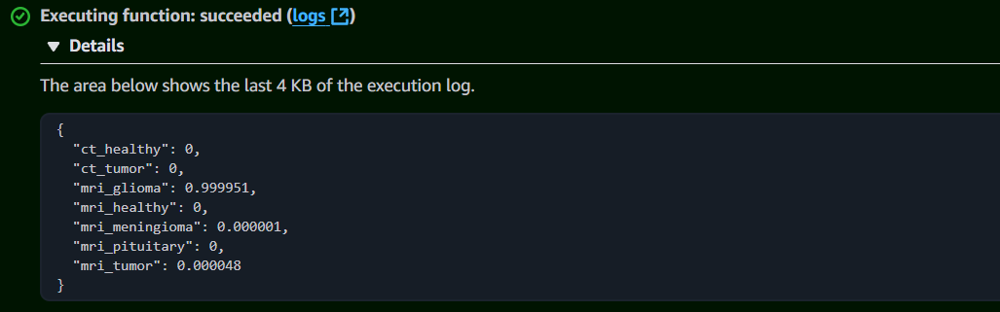
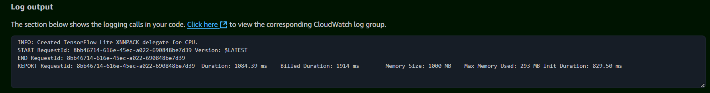

# Brain Cancer Detection with Deep Learning

# Introduction

This repository contains the implementation of a machine learning model designed to detect brain cancer using CT and MRI images. This project is part of the final capstone for the Machine Learning Zoomcamp course offered by DataTalksClub.

# Objective (Value Proposition)
Brain cancer diagnosis is a critical medical task that typically requires expert analysis of imaging data. This project leverages machine learning techniques to assist in the detection of brain cancer from CT and MRI scans. The primary goal is to develop an accurate and efficient model that can identify cancerous images, offering a proof-of-concept for practical medical applications.

# From a ML Perspective

## Problem Definition
This project is framed as a Multiclass Classification Problem. The objective is to determine whether a patient's CT scan or MRI indicates the presence of a tumor. Additionally, for MRI scans, the model aims to classify the type of tumor when applicable.

To achieve this, I will build a model based on a Convolutional Neural Network (CNN) and employ the transfer learning technique. Specifically, I will utilize the Xception model, which has been pre-trained on the ImageNet dataset. By leveraging Xception's feature extraction capabilities, I can fine-tune the model using the dataset's images to optimize it for this task.

So, the model will consists of three main components: 

1. A feature extraction layer using Xception pre-trained model to generate feature maps from the input images
2. A dense neural network layer to identify and refine patterns from these features
3. And a probabilistic classifier with a softmax activation to output the probabilities for each class in the multiclass classification task. 

In the serving phase, the input will be an image, and the output will represent the probabilities of the image belonging to each class.

## Evaluation Definition

Finally, to determine the evaluation metrics we will focus on, we need to analyze the potential implications of incorrect predictions in the context of cancer detection. The goal is to ensure that the model provides meaningful support to medical decision-making while minimizing potential adverse effects.

In cases where a cancerous tumor is not detected (false negative), the consequences could be critical, as it may lead to delayed diagnosis and treatment, reducing the patient’s chances of recovery. Therefore, minimizing this condition will be our highest priority. The metric associated with this situation is Recall.

On the other hand, in cases where a healthy patient is mistakenly identified as having cancer (false positive), the impact is less severe but still significant. This misclassification may lead to unnecessary stress for the patient and additional diagnostic procedures, which can incur financial and psychological costs. The metric tied to this scenario is Precision, to which we will assign moderate priority.

Additionally, we will rely on ROC-AUC as a comprehensive measure to evaluate the model's ability to distinguish between cancerous and non-cancerous cases, ensuring robust performance across different threshold levels.

## Summary
With these considerations, the problem is described as follows:

- Problem Type:             Multiclass Classification
- Learning Type:            Supervised
- Evaluation Metrics:       Recall (High priority), Precision (Moderate Priority), and ROC-AUC (support).
- Architecture              Deep Learning – Convolutional Neural Network with Transfer Learning

# Repository Structure.

    mlzoomcamp_cp1/
    |-- Dataset/             # Dataset (train, test and validation splits)
    |-- deployment/          # Files required for replication and deployment (Dockerfile and testing scripts)
    |-- models/              # Saved models and weights
    |-- raw_data/            # A copy of the dataset+
    |-- references/          # Relevant contextual information adn bibliography
    |-- notebook.ipynb       # Data preparation, EDA, Model Selection, and Parameter Tuning
    |-- README.md            # Project overview
    |-- train.ipynb          # Final model training

- The preprocessing, EDA and model trainning phase is documented in the [notebook.ipynb](https://github.com/Maxkaizo/mlzoomcamp_cp1/blob/main/notebook.ipynb) file.
- You can find an example of the model usage with the standard tensorflow library here [use_model.ipynb](https://github.com/Maxkaizo/mlzoomcamp_cp1/blob/main/deployment/use_model.ipynb)
- And an alternate version with `tflite_runtime` and `keras_image_helper` here [use_litemodel.ipynb](https://github.com/Maxkaizo/mlzoomcamp_cp1/blob/main/deployment/use_litemodel.ipynb)
- If you want to test it, check the [Deployment](https://github.com/Maxkaizo/mlzoomcamp_cp1/tree/main?tab=readme-ov-file#deployment) section
- During the exploration process I've saved the model several times using the keras' `ModelCheckpoint()` class, and you also can see an example of how to convert a model to a tensoflow lite version in [convert_model.ipynb](https://github.com/Maxkaizo/mlzoomcamp_cp1/blob/main/deployment/convert_model.ipynb)

# Domain Context
If you need (as I did) some context regarding the referred medical procedures, what is a CT Scan and an MRI, I'm including some definitions [here](https://github.com/Maxkaizo/mlzoomcamp_cp1/blob/main/references/Domain_Context.md)

# Dataset
For this project, I've used the [Brain Tumor Multimodal Image (CT & MRI) dataset](https://www.kaggle.com/api/v1/datasets/download/murtozalikhon/brain-tumor-multimodal-image-ct-and-mri) from Kaggle. This dataset includes a collection of scans sourced from multiple patients. According to its description:

    "The dataset includes high-resolution CT and MRI images captured from multiple patients, with each image labeled with the corresponding tumor type (e.g., glioma, meningioma, etc.) and its location within the brain. This combination of CT and MRI images aims to leverage the strengths of both imaging techniques: CT scans for clear bone structure visualization and MRI for soft tissue details, enabling a more accurate analysis of brain tumors."

You can find a copy of the raw dataset in [raw_data](https://github.com/Maxkaizo/mlzoomcamp_cp1/tree/8a298f32f35f449b274b5cd76f47d375ca4abcc9/raw_data) folder

# Deployment
In this project, I will implement the service as a Docker container (available in [deployment](https://github.com/Maxkaizo/mlzoomcamp_cp1/tree/main/deployment)), and subsequently deploy it as a Lambda function on AWS. 

A detailed guide to replicate the deployment can be found in the readme file in the deployment section

### Cloud Test

To test on the cloud deployment, you can use this script [deployment](https://github.com/Maxkaizo/mlzoomcamp_cp1/tree/main/deployment).
Please contact me through slack @Maxkaizo or email pptmtz@gmail.com and I'll send you an API KEY

```
import requests

url = 'https://wx2naanqv2.execute-api.us-east-1.amazonaws.com/test_stage/detect'

data = {'url': 'https://raw.githubusercontent.com/Maxkaizo/mlzoomcamp_cp1/8a298f32f35f449b274b5cd76f47d375ca4abcc9/deployment/test_img_glioma.jpg'}

# API Key
api_key = 'API_KEY_HERE'

headers = {
    'x-api-key': api_key
}

result = requests.post(url, json=data, headers=headers).json()

print(result)
```
The test should look like this


And here's an example of the lambda output



# Potential Improvements (To Do's)

- Apply early stopping
- Train a model from 0 and check performance
- Use another pretrained model like DenseNet
- USe Vision Transformers and check performance